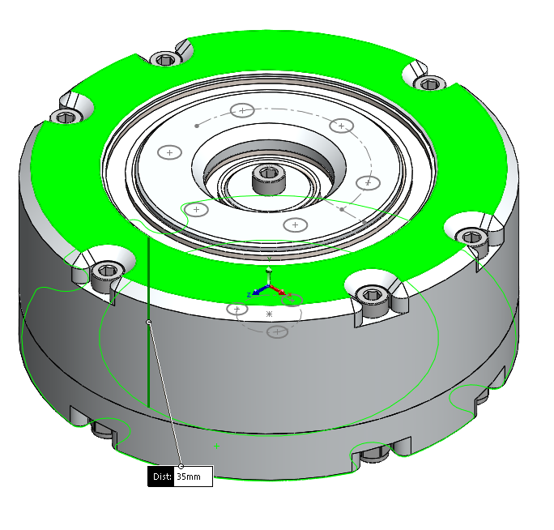
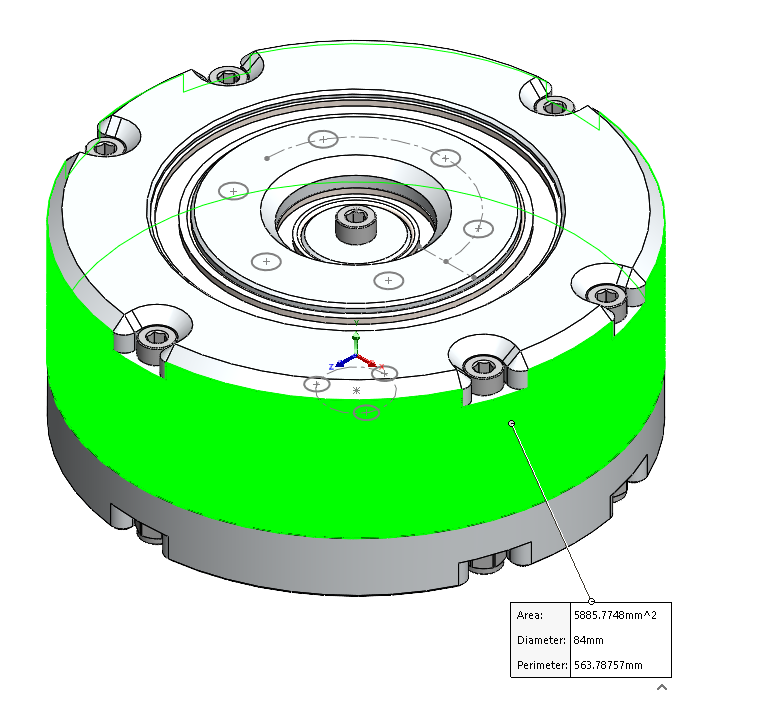

# WIP_Actuator

Work in progress, ongoing project. Aiming for end of year completion.

Propossed characteristics:
- Lightweight, machined
- 3kW stator, axial flux
- Low-reduction ratio, potentially cycloidal
- High efficiency, high eleE/mechE ratio
- Novel cooling (???)
- ~300 rpm, >60Nm
- ....Cost....   :(

Progress photo(s):

